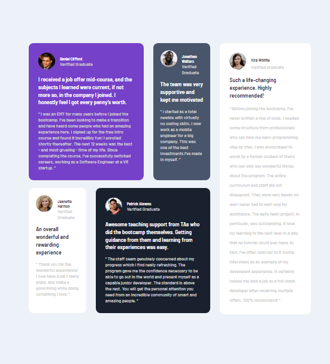

#  Front end-mentor challenge testimonials-grid-section-main

## This project, is a challeng that is gotten from **Front end mentor** and its aim a improving our developmet skill , it a  web template of a grid testimonia.

## The project is  built with HTML and CSS.  The markup was done using HTML, and the styling was done using CSS,  it was done applying grid and flex style.
### 1 HTML
### 2 CSS

### FLex box

